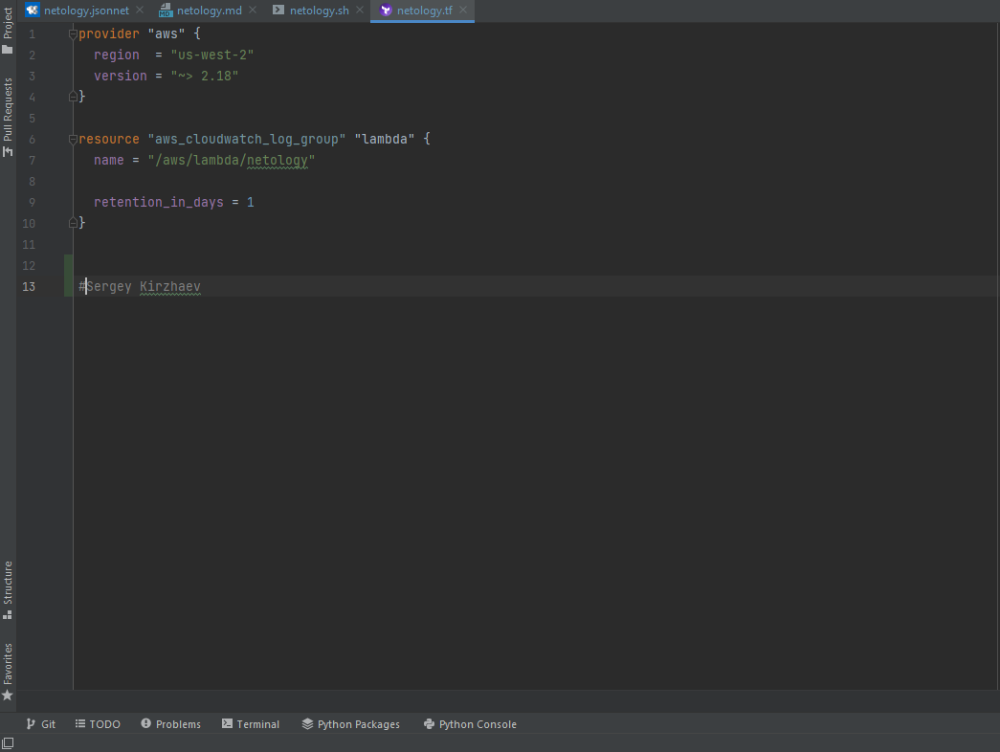
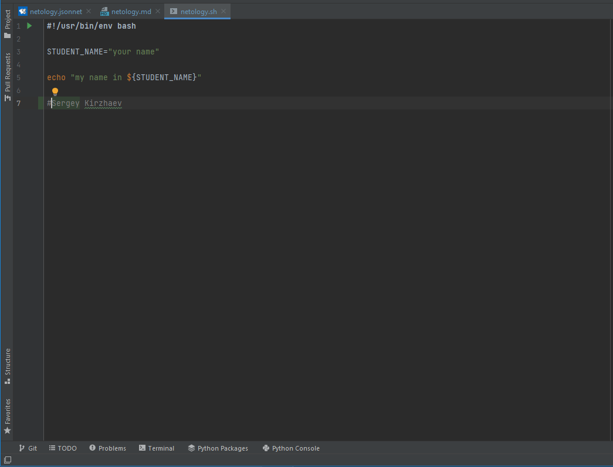
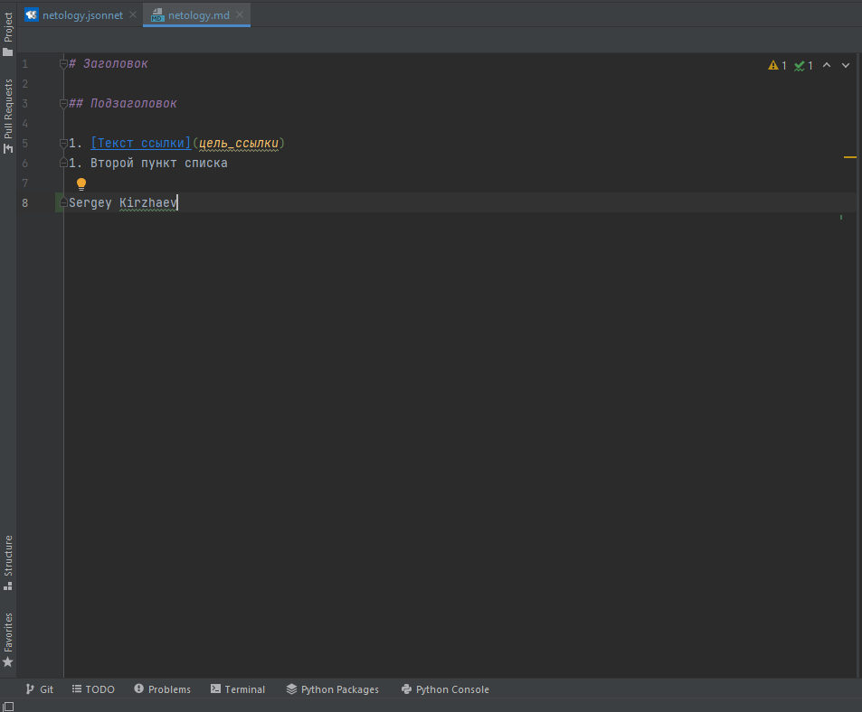
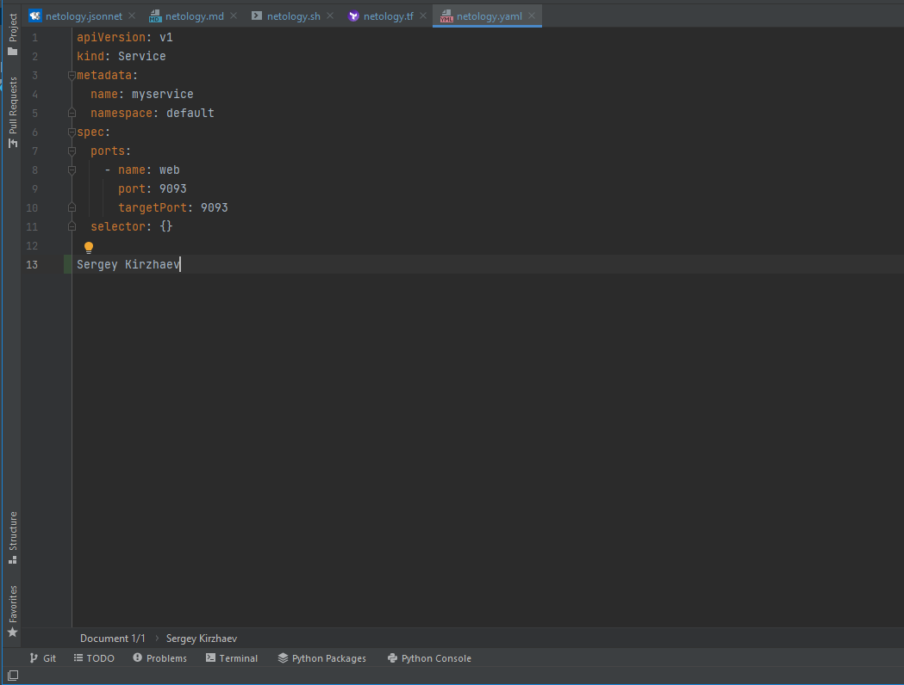
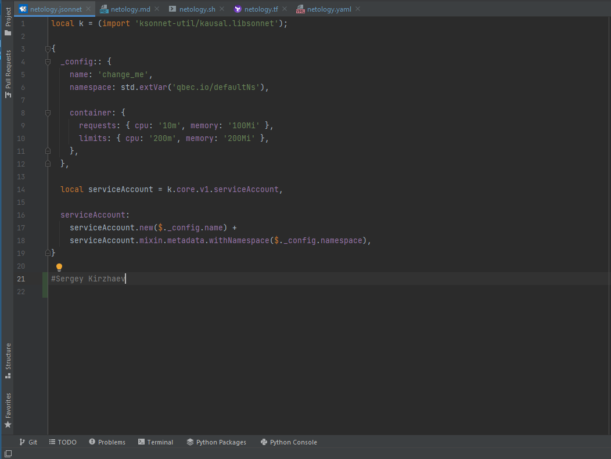

Задача 1
--------
**Terraform**

**Bash**

**Markdown**

**Yaml**

**Jsonnet**

Задача 2
--------
**Жизненный цикл задачи**

1. Совместное обсуждение деталей будущих изменений заказчиком, менеджером, разработчиками и др. Результатом этих коммуникаций является   подробная структурированная документация, которая помещается в доступное для всех участников процесса место.
2. Разработчики при взаимодействии с DevOps выбирают инструментарий для решения задачи. Критериями выбора служат используемые в настоящее время инструменты и доступная ресурсная база.
3. Разработчики приступают к написанию кода.
4. Devops разворачивает инфраструктуру: всевозможные "шоурумы", "песочницы", тестовые контуры.
5. В процессе рождения кода возникает потребность в его тестировании. Часть небольших тестов возможна на локальных станциях разработчиков и прогоняется там же. Для масштабных тестов функционального взаимодействия, внешних интеграций и др.  привлекаются команды тестировщиков и DevOps. Значительная часть тестов должна проводиться в автоматическом режиме. DevOps принимает непосредственное участие в автоматизации тестов.
6. После успешного прохождения тестов производится выкладка кода в продуктив. DevOps-ом предусматриваются сценарии автоматической выкладки и автоматического отката изменений в случае незапланированного поведения кода.
